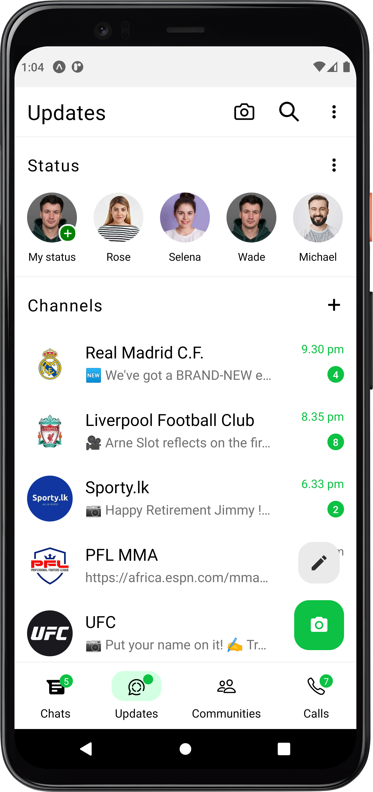
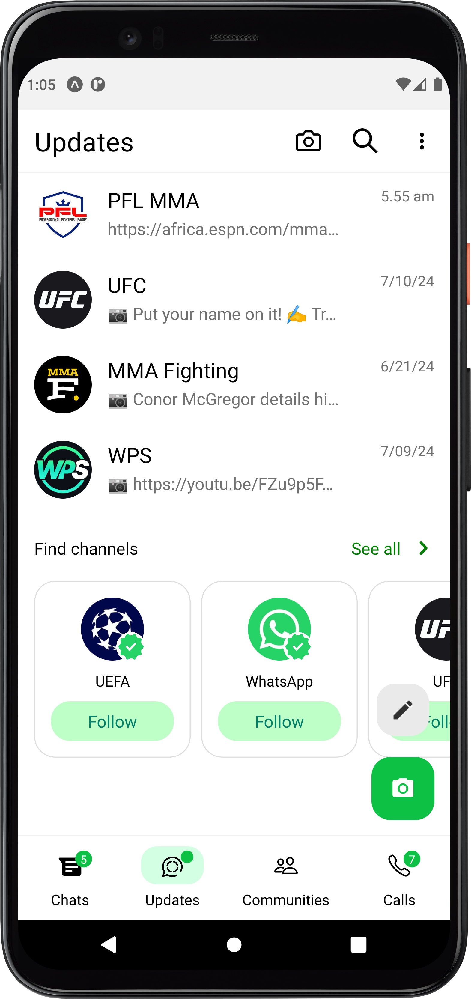
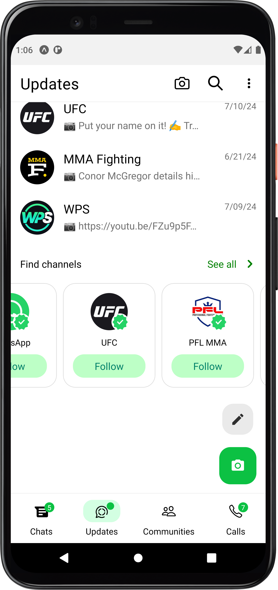

# WhatsApp UI Clone with React Native & Expo 👋

This is an [Expo](https://expo.dev) project created with [`create-expo-app`](https://www.npmjs.com/package/create-expo-app).

## Get started

1. Install dependencies

   ```bash
   npm install
   ```

2. Start the app

   ```bash
    npx expo start
   ```

## Screenshots

#### Chat Screen

<br>

#### <br>Updates Screen

<br>
<div style="display: flex;">
  
  
  
</div>


   

